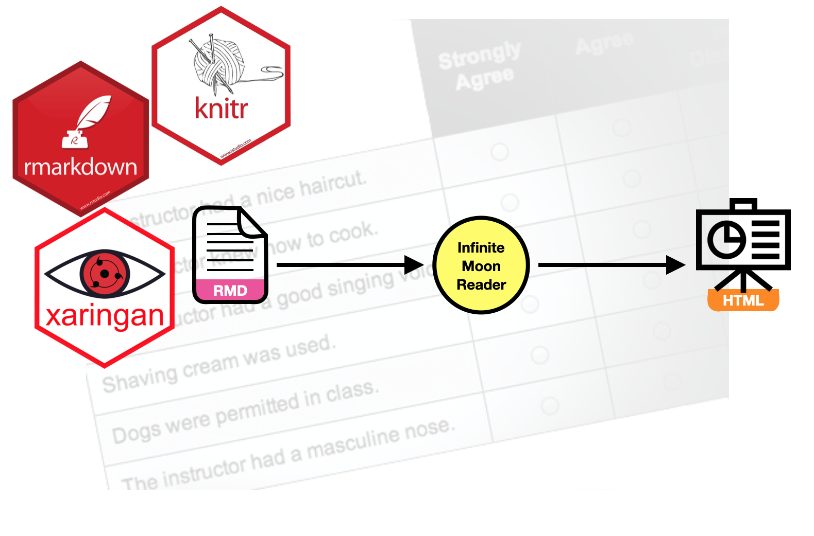

\frenchspacing

The goal of this assignment is to give you experience using probability distributions in a regression analysis. You will also obtain experience with xaringan to produce a slide deck using R Markdown.

In this assignment, you will use the data from the file *evaluations.csv* to explain variation in students' course ratings. 

- [[CSV]](https://raw.githubusercontent.com/zief0002/epsy-8252/master/data/evaluations.csv)
- [[Data Codebook]](https://zief0002.github.io/book-8252/data-codebook.html#evaluations)


```{r echo=FALSE, out.width="50%", fig.align='center'}

```


## Instructions

**Create an HTML slide deck using R Markdown and xaringan to respond to each of the questions below.** Each question should be answered on a new slide. (You can learn about xaringan in the [Slides with xaringan](https://github.com/zief0002/epsy-8252/raw/master/notes/rmarkdown/s21-slides-with-xaringan.pdf) notes; also available on the "Readings" page of the course website.)Please adhere to the following guidelines for further formatting your assignment:

- All graphics should be resized so that they do not take up more room than necessary and should have an appropriate caption. Learn how to do this in a code chunk using [knitr syntax](http://yihui.name/knitr/).
- Any typed mathematics (equations, matrices, vectors, etc.) should be appropriately typeset within the document using Markdown's equation typesetting. See [here](http://www.calvin.edu/~rpruim/courses/m343/F12/RStudio/LatexExamples.html) for some examples of how mathematics can be typeset in R Markdown.
- All syntax should be hidden (i.e., not displayed) unless specifically asked for.
- Any messages or warnings produced (e.g., from loading packages) should also be hidden.

For each question, specify the question number (e.g., Question 2) using a level-2 (or smaller) header. Submit a printed version of both the RMD and knitted file. This assignment is worth 15 points.

\newpage


# Part I: Model-Level Inference

Fit a regression model that uses professor's beauty rating, professor's age, and professor's sex to explain variation in course ratings. Do not trim this model; leave all predictors in the model whether they are statistically significant or not.


1. Partition the total sum of squared error and degrees of freedom into model and error components. On your slide, present the model sum of squares and degrees of freedom in the left column and the error sum of squares and degrees of freedom in the right column. Give each column a heading so it is clear what is being presented in each, and use a multiline display equation to indicate the value of the sum of squares and degrees of freedom for each. (No need to show your work unless you want to.)

2. Use the partitioning from Question \#1 to compute the mean squares for the model and error. Show the syntax you used to compute these values along with your output. Indicate which mean square is being computed by commenting the syntax. 

3. Compute the observed *F*-statistic. Use an inline code chunk to present this in a sentence; "The observed *F*-statistic is [*insert R chunk*]"

4. Use the cumulative density functionality in R to find the *p*-value to test the null hypothesis $H_0:\rho^2=0$ using the observed *F*-value you computed in Question \#3. Show your syntax and output.

5. Create an ANOVA table that gives the model and error partitioning for the sum of squares and degrees of freedom. Also include the mean squares, the *F*-statistic and the *p*-value. The formatting of this table will look similar to the output from the `anova()` function, except the partitioning will only be between model and error.


# Part II: Coefficient-Level Inference

For all of the questions in Part II, use the partial effect of `age` from the fitted model.

6. Compute the observed *t*-statistic associated with the partial effect of age. Show your work via syntax.

7. Use the cumulative density function to find the *p*-value to test the hypothesis that $H_0:\beta_{\mathrm{Age}}=0$ using the observed *t*-value you computed in Question \#6. Show your work/syntax.

8. Create a plot of the probability density function of the *t*-distribution you used in Question \#7. Also shade the cumulative density associated with the *p*-value under this distribution. (Hint: This should look similar to Figure 4.3 in the *Probability Distributions* unit notes.) Show the plot in the right-hand column of your slide, and show  the syntax used to create it in the left-hand column. **(2pts.)**

9. Compute the absolute value of the quantile of the *t*-distribution you used in Question \#7 that is associated with the 2.5th percentile. Show that this is equal to the absolute value of the quantile of the *t*-distribution associated with the 97.5th percentile.

10. Use the value you computed in Question \#9 to compute the 95\% confidence interval for the effect of age using the formula: $\mathrm{CI}_{95\%}=\hat\beta_k \pm t^{*}(SE_{\beta_k})$ where $t^{*}$ is the quantile value that you. found in Question \#9. Show your work.


# Part III: Simulation

11. Use the coefficient estimates and residual standard error from the fitted model to randomly generate a simulated course rating for a 31 year old, female professor who has a beauty rating of 1. Show your syntax.

12. Randomly generate 1,000 course ratings for a 31 year old, female professor who has a beauty rating of 1. Sort these ratings from smallest to largest, and then find the 2.5th and 97.5th percentiles (quantiles). (This range is called a "prediction interval" as it expresses the uncertainty in a individual's predicted outcome. Since we are finding the percentiles that demarcate the middle 95\% of the distribution, it is a 95\% prediction interval.) Report the endpoints you just found for the 95\% prediction interval. (Note that a prediction interval, uncertainty for an individual's outcome, is different than a confidence interval, uncertainty in a mean value of the outcome.) Show you syntax.


# Part IV: Adding Bells-and-Whistles to Your Slide Deck

13. Add a title slide. This slide should include the title of your deck, a photo, and all of your group members' names. Create this title slide as the first slide in your deck rather than via the YAML. If you use a photo from the internet, be sure to give image credit. Create a slide titled "Image Credits" and add the credit/citation.

14. In the slide for Question \#8, use an incremental reveal to show the syntax in the left column initially and then the plot in the right column.


