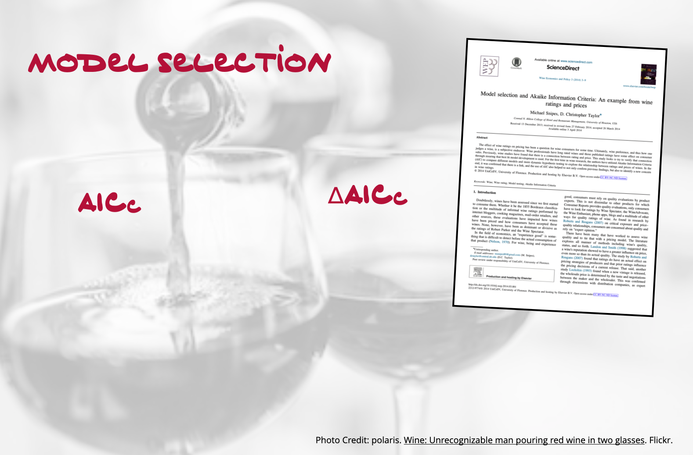

The goal of this assignment is to build your understanding of using information criteria for model selection.

In this assignment, you will use the data from the file *wine.csv* to examine several different predictors of wine rating (a measure of the wine's quality). The literature has suggested that price of wine is quite predictive of a wine's quality. You will be carrying out a replication study (using a different data set) of a study published by Snipes and Taylor (2014). 

- [[CSV]](https://raw.githubusercontent.com/zief0002/epsy-8252/master/data/wine.csv)
- [[Data Codebook]](http://zief0002.github.io/epsy-8252/codebooks/wine.html)


```{r echo=FALSE, out.width="50%", fig.align='center'}

```

## Instructions

Submit either an HTML file or, if you are not using R Markdown, a PDF file of your responses to the following questions. Please adhere to the following guidelines for further formatting your assignment:

- All graphics should be resized so that they do not take up more room than necessary and should have an appropriate caption.
- Any typed mathematics (equations, matrices, vectors, etc.) should be appropriately typeset within the document using Markdown's equation typesetting.
- All syntax should be hidden (i.e., not displayed) unless specifically asked for.
- Any messages or warnings produced (e.g., from loading packages) should also be hidden.

This assignment is worth 13 points.


<br />


## Preparation

Read the article [Model selection and Akaike Information Criteria: An example from wine ratings and prices](http://www.sciencedirect.com/science/article/pii/S2212977414000064). 

<br />

## Model Selection 1

Fit the same nine candidate models that Snipes and Taylor fitted in their analysis, but use the *wine.csv* data. In these models use wine rating (`rating`) as the outcome. The point is not to replicate their exact data, but to use the same set of predictors---even though in our dataset the predictors have different levels (e.g., our data includes more regions than Snipes and Taylor's data). By using a different set of data we can more vigorously evaluate the underlying working hypotheses.

1. Create a table of model evidence that includes the following information for each of the nine candidate models. **(2pts.)**

    - Model
    - Log-likelihood
    - K
    - AICc
    - $\Delta$AICc
    - Model Probability

Use this table of model evidence to answer Questions 2--5.

2. Use the AICc values to select the working hypothesis with the most empirical evidence.

3. Interpret the model probability/AICc weight for the working hypothesis with the most empirical evidence.

4. Compute and interpret the evidence ratio that compares the two working hypotheses with the most empirical evidence.

5. Examine the tenability of the regression assumptions (linearity, independence, normality, homoscedasticity) for the fitted model associated with the working hypothesis with the most empirical evidence. Comment on the tenability of these asumptions and provide any evidence (graphical or numerical) you use in this endeavor.

<br />

# Model Selection 2

6. Re-fit all nine candidate models using the natural logarithm of wine rating as the outcome. Also log-transform price (using the natural logarithm) in all of the models. Create the same table of model evidence you did in Question 1, but for the re-fitted models. **(2pts.)**

Use this table of model evidence to answer Questions 7--11.

7. Using the fitted model associated with the working hypothesis that has the most empirical evidence, examine the tenability of the regression models distributional assumptions (average residual is zero, independence, normality, homoscedasticity). Comment on the tenability of these assumptions and provide any evidence (graphical or numerical) you use in this endeavor.

8. Based on previous literature, Snipes and Taylor hypothesized that price was an important predictor of wine quality. Based on your analyses, is price an important predictor of wine quality? Justify your response by referring to the model evidence. (Hint: Pay attention to which models include price and which do not.)

9. Does the empirical evidence support adopting more than one working hypothesis? Justify your response by referring to the model evidence.

10. Does the empirical evidence from the Snipes and Taylor analyses support adopting more than one candidate model? Justify your response by by referring to the model evidence.

11. Based on your responses to the last two questions, which set of analyses (yours or Snipes and Taylor) has more model selection uncertainty? Explain.


