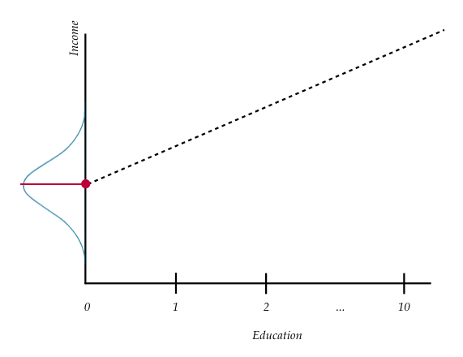
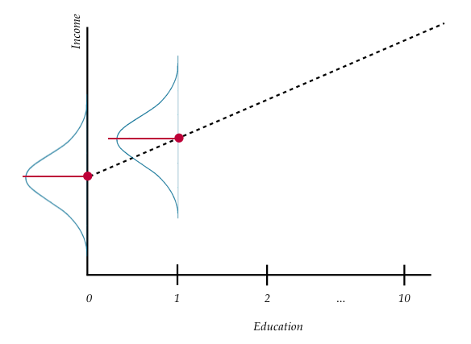

# Simple Linear Regression---Description {#simple-descript}

```{r echo=FALSE, message=FALSE}
options(max.print = "75")
options(scipen = 5)
options(digits = 4)

library(knitr)
opts_chunk$set(prompt = FALSE, comment = NA, message = FALSE, warning = FALSE, tidy = FALSE, fig.align = 'center')
opts_knit$set(width = 85)
```


In this set of notes, you will begin your foray into regression analysis. To do so, we will use the *riverview.csv* data (see the [data codebook](#riverview) here) to examine whether education level is related to income for the sample of $n=32$ employees working for the city of Riverview.


## Preparation

```{r preparation, warning=FALSE, message=FALSE}
# Load libraries
library(corrr)
library(dplyr)
library(ggplot2)
library(readr)
library(sm)

# Read in data
city = read_csv(file = "~/Documents/github/epsy-8251/data/riverview.csv")
head(city)
```

## Data Exploration

Any analysis should start with an initial exploration of the data. During this exploration, you should examine each of the variables that you will be including in the regression analysis. This will help you understand results you get in later analyses, and will also help foreshadow potential problems with the analysis. For additional detail, [this blog post](https://www.analyticsvidhya.com/blog/2016/01/guide-data-exploration/) describes initial ideas of data exploration reasonably well. You could also refer to almost any introductory statistics text. 

It is typical to begin by exploring the distribution of each variable separately. These distributions are referred to as *marginal distributions*. After that, it is appropriate to explore the relationships between the variables. 

### Income

To begin this exploration, we will examine the marginal distribution of employees' incomes. We can plot a marginal distribution using the `sm.density()` function from the **sm** package.

```{r fig.width=6, fig.height=6, out.width='50%', fig.cap="Density plot of employee incomes."}
sm.density(city$income, xlab = "Income")
```

This plot suggests that employees' incomes are unimodal with most incomes between roughly \$50,000 and \$70,000. The rug at the bottom of the plot (the small vertical line segments) show the 32 incomes from our sample. The smallest income in the sample is about \$25,000 and the largest income is over \$80,000. (We could find the exact values using the `summary()` function.) This suggests there is a fair amount of variation in the data. 

To further summarize the distribution, it is typical to compute and report summary statistics such as the mean and standard deviation. One way to compute these values is to use functions from the **dplyr** library.

```{r}
city %>% 
  summarize(
    M = mean(income), 
    SD = sd(income)
    )
```

Describing this variable we might write,


> The marginal distribution of income is unimodal with a mean of 53.74 thousand dollars. There is variation in employees' salaries (SD = 14.55 thousand dollars). 


### Education Level

We will also examine the distribution of the education level variable.

```{r fig.width=6, fig.height=6, out.width='50%', fig.cap='Density plot of employee education levels.'}
# Plot
sm.density(city$education, xlab = "Education Level")
```


Computing the mean and standard deviation:

```{r}
# Summary statistics
city %>% 
  summarize(
    M = mean(education), 
    SD = sd(education)
    )
```


Again, we might write,

> The marginal distribution of education is unimodal with a mean of 16 years. There is variation in employees' level of education (SD = 4.4).


## Relationship Between Variables

Although examining the marginal distributions is an important first step in the analysis, those descriptions do not help us directly answer our research question. To better understand the relationship between income and education level we need to explore the distribution of income ($Y$) as a function of education ($X$). To do this, we will create a scatterplot of incomes versus education. 


### Scatterplot

Below, we use `ggplot()` to create a scatterplot.

```{r fig.width=6, fig.height=6, out.width='50%', fig.cap='Scatterplot displaying the relationship between employee education levels and incomes.'}
ggplot(data = city, aes(x = education, y = income)) +
  geom_point() +
  theme_bw() +
  xlab("Education (in years)") +
  ylab("Income (in thousands of U.S. dollars)")
```

The plot suggests a relationship (at least for these employees) between level of education and income. When describing the relationship we want to touch on four characteristics of the relationship:

- Functional form (structure) of the relationship
- Direction
- Strength
- Observations that do not fit the trend (outliers)


### Correlation

To numerically summarize relationships between variables, we typically compute correlation coefficients. The correlation coefficient is a quantification of the direction and strength of the relationship. (It is important to note that the correlation coefficient is only an appropriate summarization of the relationship if the functional form of the relationship is linear.) 

To compute the correlation coefficient, we use the `correlate()` function from the **corrr** package. We can use the dplyr-type syntax to select the variables we want correlations between, and then pipe that into the `correlate()` function. Typically the response (or outcome) variable is the first variable provided in the `select()` function, followed by the predictor.

```{r}
# Load corrr package
library(corrr)

# Compute correlation between income and education level
city %>%
  select(income, education) %>%
  correlate()
```

When reporting the correlation coefficient is is conventional to use a lower-case $r$ and report the value to two decimal places. Subscripts are also generally used to indicate the variables. For example,

$$
r_{\mathrm{education,~income}} = 0.79
$$

Combining the information culled from the scatterplot with that of the correlation analysis, we could summarize the relationship between education level and income as,

> There is a strong, positive, linear relationship between education level and income ($r = .79$). This suggests that city employees with lower education levels tend to have lower incomes, on average, than employees with higher education levels.


## Statistical Model

The analytic goal is to now describe the relationship using a statistical model. Since the structure of the relationship between education level and income seems reasonably linear, we will use a *linear model* to describe the data. We can express this model mathematically as,

$$
Y_i = \beta_0 + \beta_1(X_i) + \epsilon_i.
$$

In this equation,

- $Y_i$ is the outcome/response value; it has an $i$ subscript because it can vary across cases/individuals.
- $\beta_0$ is the intercept of the line that best fits the data; it does not vary across individuals.
- $\beta_1$ is the slope of the line that best fits the data; it does not vary across individuals.
- $X_i$ is the predictor value; it has an $i$ subscript because it can vary across cases/individuals.
- $\epsilon_i$ is the error term; it has an $i$ subscript because it can vary across cases/individuals.

The regression model can be seperated into two components: a *systematic* (or fixed) component and a *random* (or stochastic) component. 

$$
Y_i = \underbrace{\beta_0 + \beta_1(X_i)}_{\substack{\text{Systematic} \\ \text{(Fixed)}}} + \underbrace{\epsilon_i}_{\substack{\text{Random} \\ \text{(Stochastic)}}} 
$$

### Fitted Regression Equation

The systematic (fixed) part of the equation gives the predicted $Y$ given a particular $X$-value. The notation for the predicted $Y$ is $\hat{Y}$. We express this mathematically as, 

$$
\hat{Y}_i = \beta_0 + \beta_1(X_i).
$$

This is sometimes referred to as the *fitted regression equation* or the *fitted equation*. The terms $\beta_0$ and $\beta_1$ are referred to as the regression parameters. One of the primary goals of a regression analysis is to estimate the values of the regression parameters (i.e., the intercept and slope terms). (Note that the fitted equation does not include any error terms.) 

### Errors

Now we can re-write the statistical model, substituting $\hat{Y}_i$ in for the fitted part of the model.

$$
\begin{split}
Y_i &= \beta_0 + \beta_1(X_i) + \epsilon_i \\
Y_i &= \hat{Y}_i + \epsilon_i 
\end{split}
$$

This equation implies that each observed $Y$-value is the sum of the predicted value of the $Y$ (which is based on the $X$-value) and some error term. Re-arranging the terms, we can mathematically express the error term as,

$$
\epsilon_i = Y_i - \hat{Y}_i
$$

To compute an observation's error, we compute the difference between the observation's observed value ($Y_i$) and its predicted value ($\hat{Y}_i$) based on the fitted equation. When the observed value of $Y$ is larger than the predicted value of $Y$ the error term will be positive (underprediction). If the observed value of $Y_i$ is smaller than the predicted value of $Y_i$ the error term will be negative (overprediction).

## Details about the Regression Model 

One question you may have is, why is there an error term in the statistical model? We use a single line to describe the relationship between education and income. This line is the same for all of the observations in the sample. For example, look at the figure below which shows the relationship between education and income, but this time also includes the regression line.

```{r echo=FALSE, fig.width=6, fig.height=6, out.width='50%', fig.cap='Scatterplot displaying the relationship between employee education levels and incomes. The OLS fitted regression line is also displayed.'}
ggplot( data = city, aes(x = education, y = income) ) +
  geom_point() +
  geom_smooth(method = "lm", se = FALSE) +
  geom_point(x = 10, y = 37831, color = "blue", size = 4) +
  theme_bw() +
  xlab("Education (in years)") +
  ylab("Income (in thousands of U.S. dollars)")
```

Consider all the employees that have an education level of 10 years. For all three of them we would predict an income of approximately \$37,800. This is denoted by the blue point on the line. The error term allows for discrepancy between the predicted $Y$ and the observed $Y$, which allows us to recover our observed value of the response variable from the model.

Graphically, the residual is represented by the vertical distance between the line and a given point on the scatterplot. Some of those points are above the line (they have a positive residual) and some are below the line (they have a negative residual). Also note that for some observations the error term is smaller than for others.

### Notation

The regression model and the fitted regression equation describe the linear relationship in the *population*. Greek letters indicate a *parameter* (a summary of the population). That is why we use the Greek letters $\beta$ and $\epsilon$ when we notate the regression model. 

In most statistical analyses, you will use a *sample* of data (not the entire population). When we summarize a sample, it is referred to as a *statistic*, and we use either Roman letters or a Greek letter with a hat. This indicates that the summary measure is an estimate of the parameter. For example, the values produces for the intercept and slope from a regression analysis are estimates. Since they are estimates, we use the hat-notation on the greek letters. 

$$
\hat{Y}_i = \hat{\beta}_0 + \hat{\beta}_1(X_i)
$$

The parameter estimates are also referred to as regression coefficients. Synonymously, a hat means estimated/predicted value. Some people use Roman letters when referring to sample estimates.

$$
\hat{Y}_i = B_0 + B_1(X_i)
$$

Similarly, in the population the error terms are expressed as the Greek letter epsilon ($\epsilon_i$), while in the sample we use the Roman letter e ($e_i$). The sample errors are also referred to as *residuals*.

## Estimating the Regression Coefficients Using R

To fit the regression model to data using R, we will use the `lm()` function. The syntax for this function looks like this:

> `lm(`**outcome** ~ `1 + ` **predictor**, `data =` **dataframe**`)`

where **outcome** is the name of the outcome/response variable, **predictor** is the name of the predictor variable, and **dataframe** is the name of the data frame. (The one on the right side of the tilde tells R to include the intercept in its computation.) When we fit a regression model in R, we will also assign the output to a new object in R. Below, we fit the model using education level to predict income.

```{r}
lm.1 = lm(income ~ 1 + education, data = city)
```

Here the output is assigned to an object called `lm.1`. We can print the regression parameter estimates by typing the `lm()` object name and hitting enter.

```{r}
lm.1
```

Here the parameter estimates (or regression coefficients) are:

- $\hat{\beta}_0 = 11.32$
- $\hat{\beta}_1 = 2.65$

The fitted regression equation is

$$
\hat{\mathrm{Income}}_i = 11.32 + 2.65(\mathrm{Education~Level}_i).
$$

### Intercept Interpretation

The estimate for the intercept was 11.32. Graphically, this value indicates the $y$-value where the line passes through the $y$-axis (i.e., $y$-intercept). As such, it gives the predicted value of $Y$ when $X = 0$. Algebraically we get the same thing if we substitute 0 in for $X_i$ in the estimated regression equation.

$$
\begin{split}
\hat{Y}_i &= \hat{\beta}_0 + \hat{\beta}_1(0) \\
\hat{Y}_i &= \hat{\beta}_0 
\end{split}
$$

In our example,

$$
\begin{split}
\hat{Y}_i &= 11.32 + 2.65(0) \\
\hat{Y}_i &= 11.32 
\end{split}
$$

To interpret this value, we use that same idea. Namely

> The predicted income for all employees that have an education level of 0 years is 11.32 thousand dollars.

### Slope Interpretation

Recall from algebra that the slope of a line describes the change in $Y$ versus the change in $X$. In regression, the slope describes the *predicted* change in $\hat{Y}$ for a one-unit difference in $X$. 

$$
\hat{\beta}_1 = \frac{\Delta\hat{Y}}{\Delta X} = \frac{2.65}{1}
$$

In our example, 

> Each one-year difference in education level is associated with a 2.65 thousand dollar predicted difference in income.

To better understand this, consider three city employees. The first employee has an education level of 10 years. The second has an education level of 11 years, and the third has an education level of 12 years. Now let's compute each employee's predicted income.

$$
\begin{split}
\mathbf{Employee~1:~}\hat{\mathrm{Income}} &= 11.32 + 2.65(10) \\
&= 37.82
\end{split}
$$


$$
\begin{split}
\mathbf{Employee~2:~}\hat{\mathrm{Income}} &= 11.32 + 2.65(11) \\
&= 40.47
\end{split}
$$


$$
\begin{split}
\mathbf{Employee~3:~}\hat{\mathrm{Income}} &= 11.32 + 2.65(12) \\
&= 43.12
\end{split}
$$

Each of the employee's education levels differ by one year (10 to 11 to 12). The difference in predicted incomes for these employees differs by 2.65 thousand dollars.


## Using the Regression Equation

Consider the first case in the data frame.

```{r}
city %>%
  filter(row_number() == 1)
```

This employee has an education level of eight years ($X_{1}=8$). His income is 37.45 thousand dollars ($Y_{1}=37.45$). Using the fitted equation, we can compute that employee's predicted income as,

```{r}
11.32 + 2.65 * 8
```

$\hat{Y}_{12} = 32.52$. 


We can also compute that employee's residual.

```{r}
37.45 - 32.52
```

$e_{1} = 4.93$.

The positive residual suggests that this employee earns 4.93 thousand dollars more than would be expected for a city employee with eight years of formal education. We can also represent these values graphically.

```{r echo=FALSE, fig.width=6, fig.height=6, out.width='50%', fig.cap="Plot displaying the OLS fitted regression line (blue) between employee education levels and incomes. The first employee's observed data (black dot) is plotted, and a visual representation of the employee's residual (red line) is also displayed."}
ggplot(data = city, aes(x = education, y = income)) +
  geom_point(alpha = 0.5) +
  geom_segment(x = 8, xend = 8, y = 37.449, yend = 32.53175, color = "darkred") +
  geom_point(x = 8, y = 37.449, size = 3) +
  geom_smooth(method = "lm", se = FALSE) +
  geom_point(x = 8, y = 32.53175, color = "blue", size = 3) +
  annotate("text", x = 7.65, y = 32.53175, label = "hat(Y)[1]", parse = TRUE, size = 3) +
  annotate("text", x = 7.65, y = 37.449, label = "Y[1]", parse = TRUE, size = 3) +
  annotate("text", x = 8.25, y = 34.99675, label = "e[1]", parse = TRUE, size = 3) +
  theme_bw() +
  xlab("Education (in years)") +
  ylab("Income (in U.S. dollars)")
```

## Conditional Averages

To this point, we have used the fitted regression equation to predict for individual employees. Another way to think about the predicted value is it describes the mean value of $Y$ for *all* cases with a particular $X$ value. For example, using the values from the previous example we found that $\hat{Y}_{1} = 37.45$ when $X_{1}=8$. Using means, we could interpret this as,

> The estimated average income for city employees having 8 years of education is 37.45 thousand dollars.

A statistician may refer to the predicted value of $Y$ as a conditional mean (it is conditioned on a particular value of $X$). To help better understand the idea of conditional means, consider the following plot:

```{r echo=FALSE, fig.width=6, fig.height=6, out.width='50%', fig.cap='Plot displaying conditional distribution of $Y$ at several $X$ values. The OLS fitted regression line (dotted) is also shown. The red points show the mean value of $Y$ for each conditional distribution.'}
knitr::include_graphics("images/conditional-means.png")
```


Examining this plot, we see at each value of $X$ there is a distribution of $Y$. For example, there would be a distribution of incomes for the employees with an education level of 8 years (in the population). There would be another distribution of incomes for the employees with an education level of 9 years (in the population). And so on.

The regression equation describes the pattern of conditional means. As such, we can write the fitted equation using means rather than $\hat{Y}$,

$$
\mu_{Y|X_i} = \beta_0 + \beta_1(X_i)
$$

The first part is read as, "the mean of $Y$ given $X_i$", or "the mean of $Y$ conditioned on $X_i$". Sometimes the mean of a population is denoted as $E(Y)$, or the expected value of $Y$. Then you might see the regression equation written as,

$$
E(Y|X_i) = \beta_0 + \beta_1(X_i)
$$


When we assume a linear functional form for the model, we are saying that the mean value of $Y$ differs by a constant amount for each one-unit difference in $X$. In other words, the difference between the mean income for those employees who have ten years of education and those that have 11 years of education *is the same as* the difference between the mean income for those employees who have 17 years of education and those that have 18 years of education.

Using this idea, the statistical model can be written as,

$$
\begin{split}
Y_i &= \beta_0 + \beta_1(X_i) + \epsilon_i \\
Y_i &= \mu_{Y|X_i} + \epsilon_i
\end{split}
$$

That is, each observations observed value ($Y_i$) is a function of the mean $Y$-value (given $X_i$) and error. The error represents how far the observed value is from that mean:

$$
\epsilon_i  = Y_i - \mu_{Y|X_i}
$$

In statistical parlance, this is referred to as a *mean deviation*.

### Intercept (Re-visited)

Using the idea of conditional means, we can re-visit the interpretation of the intercept, which we had said was the predicted $Y$ for a person with an $X$-value of zero. Now we can say that the intercept is the predicted mean income for all employees with zero years of formal education.

```{r echo=FALSE, fig.width=6, fig.height=6, out.width='50%', fig.cap='Plot displaying conditional distribution of $Y$ at $X=0$. The OLS fitted regression line (dotted) is also shown. The red points show the mean value of $Y$ for this conditional distribution---which corresponfds to the intercept value of the regression line.'}

```

## Slope (Re-visited)

Using the idea of conditional means, we can also re-visit the interpretation of the slope, which we had said was the predicted difference in $Y$ for employees with a one-year difference in education. Now we can say that the slope is the predicted difference in mean incomes between employees with education levels that differ by one year.

```{r echo=FALSE, fig.width=6, fig.height=6, out.width='50%', fig.cap='Plot displaying conditional distribution of $Y$ at $X=0$ and $X=1$. The OLS fitted regression line (dotted) is also shown. The red points show the mean value of $Y$ for these conditional distributions---the relative change which corresponfds to the slope value of the regression line.'}

```

> In general, when interpreting the slope and intercept, you should use the conditional mean interpretations.


## Revisiting the Statistical Model

Recall that the statistical model underlying the simple regression is,

$$
Y_i = \beta_0 + \beta_1(X_i) + \epsilon_i
$$

and that we can estimate the coefficients ($\hat\beta_0$ and $\hat\beta_1$) and the errors ($e_i$) using the data ($X_i$ and $Y_i$). This model can be used to express each of the 32 observations.

$$
\begin{split}
37.4 &= 11.32 &+ 2.65(8) &+ 4.93 \\
26.4 &= 11.32 &+ 2.65(8) &- 6.09 \\
47.0 &= 11.32 &+ 2.65(10) &+ 9.21 \\
34.2 &= 11.32 &+ 2.65(10) &- 3.64 \\
\vdots & & \vdots & \vdots \\
56.3 &= 11.32 &+ 2.65(22) &- 13.30 \\
70.0 &= 11.32 &+ 2.65(22) &+ 0.42 \\
79.2 &= 11.32 &+ 2.65(24) &+ 4.31 \\
\end{split}
$$

Looking at these equations, it can be seen that the coefficients ($\hat\beta_0$ and $\hat\beta_1$) are the same in all 32 equations. Because of this we say that the regression coefficients are *fixed*. The other components, $Y_i$, $X_i$, and $e_i$ vary (can be different) across the 32 equations. Because of this we say that the data ($X_i$ and $Y_i$) and the errors ($e_i$) are *random*. In writing the model, all the random components get an $i$-subscript; fixed components do not.


## One More Example

In this example, we will use the *ed-school-2018.csv* data (see [data codebook](#ed-schools) for more information) to examine whether doctoral acceptance rate (`doc_accept`) is related to expert ratings of education schools (`expert_score`) for the 129 programs ranked in the *2018 Best Graduate Schools*.  

```{r}
ed_schools = read_csv(file = "~/Documents/github/epsy-8251/data/ed-schools-2018.csv")
head(ed_schools)
```


To begin we examine the scatterplot of the relationship between the two variables. The plot below also shows the marginal distributions for the two variables. This plot was created with the `ggMarginal()` function from the **ggExtra** package. To learn more, see the **ggExtra** documentation at https://cran.r-project.org/web/packages/ggExtra/README.html.


```{r echo=FALSE, fig.width=6, fig.height=6, out.width='50%', fig.cap="Scatterplot showing the relationship between doctoral acceptance rate and expert rating for 129 graduate programs of education. Plots of the marginal distributions for these distributions are also displayed."}
library(ggExtra)

# Create scatterplot and store in p
p = ggplot(data = ed_schools, aes(x = doc_accept, y = expert_score)) +
  geom_point() +
  theme_bw() +
  xlab("Doctoral acceptance rate") +
  ylab("Administrator/expert assessment score")


# Add density plots in margins
ggMarginal(p, type = "histogram")
```


We also compute summary measure of each distribution and the correlation between them.

```{r}
# Summary measures of the predictor
ed_schools %>% 
  summarize(
    M = mean(doc_accept), 
    SD = sd(doc_accept)
    )

# Summary measures of the outcome
ed_schools %>% 
  summarize(
    M = mean(expert_score), 
    SD = sd(expert_score)
    )

# Correlation
ed_schools %>%
  select(expert_score, doc_accept) %>%
  correlate()
```

The scatterplot suggests a moderate linear negative relationship between doctoral acceptance rate and expert rating of education graduate programs ($r = -0.50$). This suggests that graduate programs that have higher expert ratings tend to have lower acceptance rates of doctoral students. The scatterplot also shows that one program (New Mexico State University) has an expert rating that is substantially lower than the other program's ratings.

```{r}
# Fit regression model
lm.2 = lm(expert_score ~ 1 + doc_accept, data = ed_schools)

# Obtain coefficients
lm.2
```

The fitted equation is:

$$
\hat{\mathrm{Expert~Rating}_i} = 4.10 - 0.01(\mathrm{Doctoral~Acceptance~Rate}_i)
$$

Interpreting the coefficients,

- Education graduate programs that accept 0\% of doctoral students have a predicted average expert rating of 4.10 (extrapolation).
- Each one-percent difference in acceptance rate is associated with a $-0.01$-point difference in ratings, on average.


