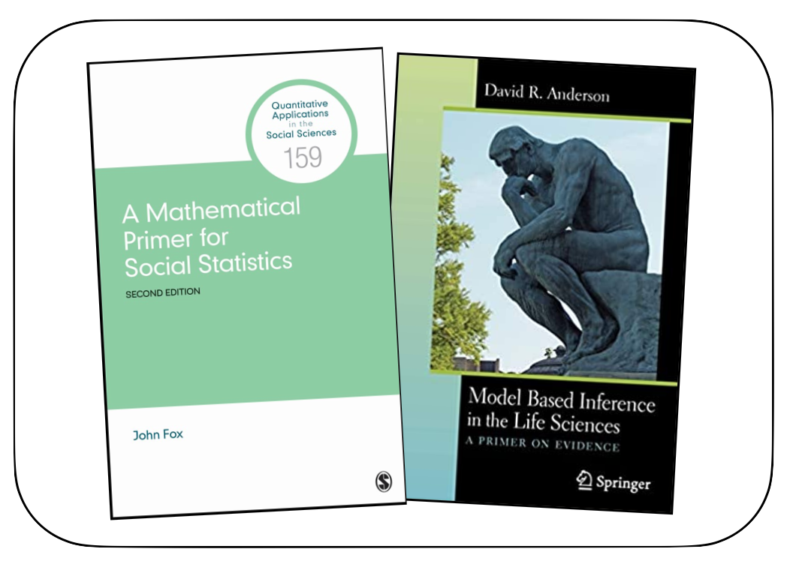

```{r knitr_init, echo=FALSE, cache=FALSE}
library(knitr)
library(rmdformats)
library(fontawesome)

## Global options
options(max.print="75")
opts_chunk$set(echo=FALSE,
	             cache=TRUE,
               prompt=FALSE,
               tidy=TRUE,
               comment=NA,
               message=FALSE,
               warning=FALSE)
opts_knit$set(width=75)
```


# Welcome to 8252 {-}


Welcome to *EPsy 8252: Methods in Data Analysis for Educational Research II*. This is the second course of a two-semester sequence for students in education. The statistical content for EPsy 8252 includes: (1) likelihood estimation and inference, (2) information criteria for model selection, (3) mixed-effects/multi-level models for analysis of cross-sectional data, (4) mixed-effects/multi-level models for analysis of longitudinal data, and (5) logistic models for analyzing dichotomous outcomes. Time permitting, miscellaneous topics (e.g., design weights, empirical Bayes estimation, semi-parametric models) will also be introduced.

<!-- The materials for the course can be accessed via: -->

<!-- **Syllabus, assignments, data, and script files:** [github repository](https://github.com/zief0002/epsy-8252) -->
<!-- **Course notes and readings:** [website](https://zief0002.github.io/book-8252/) | [github repository](https://github.com/zief0002/book-8252) -->


<br />

### Meet Your Instructional Team {-}


<figure>
  
  <figcaption>Andy (left), Amani (center-left), Hank (center-right), Sadie (right)</figcaption>
</figure>

<br />


### Contact Information {-}

Andrew Zieffler ([zief0002@umn.edu](mailto://zief0002@umn.edu)) <br />
**Office:** [Zoom](https://umn.zoom.us/my/zieffler)  <br />
<!-- **Office:** [Education Sciences Building 178](https://www.google.com/maps/place/Education+Sciences+Building/@44.9784043,-93.2394586,15z/data=!4m2!3m1!1s0x0:0x45656dac481b9150)  <br /> -->
**Office Hours:** Tuesday 9:00 AM&ndash;10:00 AM; and by appointment

<br />

Amaniel Mrutu ([apmrutu@umn.edu](mailto://apmrutu@umn.edu))  <br />
**Office:** [Zoom](https://umn.zoom.us/j/95475155331?pwd=UHFJWUQzWVYwMFQ4aFFFUlhnTUJJQT09)  <br />
**Office Hours:** Wednesday 10:00 AM&ndash;11:00 AM; and by appointment

<br />


### Syllabus {-}

The course syllabus is available  [here](https://github.com/zief0002/epsy-8252/raw/master/syllabus/s21-8252-syllabus.pdf).

<br />


### Class Meeting Times and Zoom Links {-}

- Monday/Wednesday (2:30&ndash;3:45): [Zoom]( https://umn.zoom.us/j/99947792857?pwd=c2xJZ0o3dXNMc3paU3pZbStWemFLUT09)  <!--: [Burton Hall 125](http://campusmaps.umn.edu/burton-hall)-->
- Tuesday/Thursday (11:15&ndash;12:30): [Zoom](https://umn.zoom.us/j/92778236780?pwd=cUZ2eEZESHI3ZXpJUXhRNEl6RzBkdz09)  <!--: [Peik Hall 215](http://campusmaps.umn.edu/peik-hall)-->

Note that the Zoom links are different for each section of the class.


<br />


### Textbooks {-}

<figure>
  
</figure>

This website will serve as the primary set of course notes. In addition, the following textbook is required:

- Fox, J. (2009). [A mathematical primer for social statistics.](http://dx.doi.org.ezp1.lib.umn.edu/10.4135/9781412983228) Thousand Oaks, CA: Sage.

There is also an optional textbook:

- Anderson, D. R. (2008). [Model based inference in the life sciences: A primer on evidence.](http://login.ezproxy.lib.umn.edu/login?url=http://link.springer.com/10.1007/978-0-387-74075-1) New York: Springer.

<br />


### Prerequisites {-}

Prerequisites include *EPsy 8251: Methods in Data Analysis for Educational Research I*, or a sound conceptual understanding of the topics of: 

- Foundational topics in data analysis;
  + Design (e.g., random assignment and random sampling)
  + Descriptive statistics and plots
  + One- and two-sample tests
- Correlation;
- Simple regression analysis;
  + Model-level and coefficient-level interpretation
  + Ordinary least squares estimation
  + Model-level and coefficient-level inference
  + Assumption checking/residual analysis
- Multiple linear regression
  + Model-level and coefficient-level interpretation and inference
  + Assumption checking/residual analysis
  + Working with categorical predictors (including adjusting *p*-values for multiple tests)
  + Interaction effects

For the topics listed, students would be expected to be able to carry out an appropriate data analysis and properly interpret the results. It is also assumed that everyone enrolled in the course has some familiarity with using R. 

<br />

### Miscellaneous Resources {-}

Here are two resources that might be useful:

- [Computational Toolkit for Educational Scientists](https://zief0002.github.io/toolkit/)
- [Statistical Modeling and Computation for Educational Scientists](https://zief0002.github.io/modeling/)

<!-- ### Other QME Courses -->

<!-- If you are wondering what to take after EPsy 8252, there are many advanced courses offered by QME. The "flowchart" below indicates those offerings and also any other prerequisite courses you may need. Blurred out courses are not offered in 2020-21. (I created this from memory since those documents are at school.)  -->

<!-- - [QME Course Offerings](misc/qme-course-map-2020-04-29.pdf) -->

<!-- Advanced statistics courses are also offered in many other departments around campus, most notably in the Statistics Department, and in Public Health (Biostatistics).   -->


```{r child = 'schedule.Rmd'}
```

```{r child = 'assignments.Rmd'}
```

```{r child = 'data.Rmd'}
```

```{r child = 'preparation.Rmd'}
```


