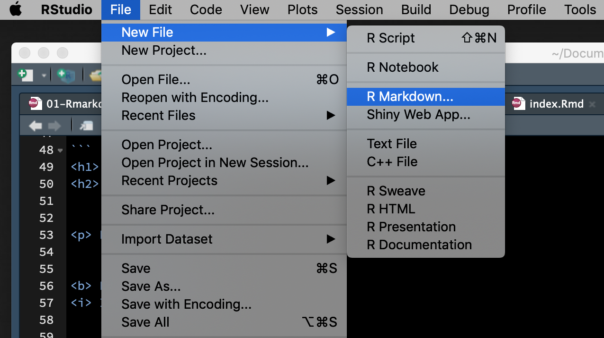
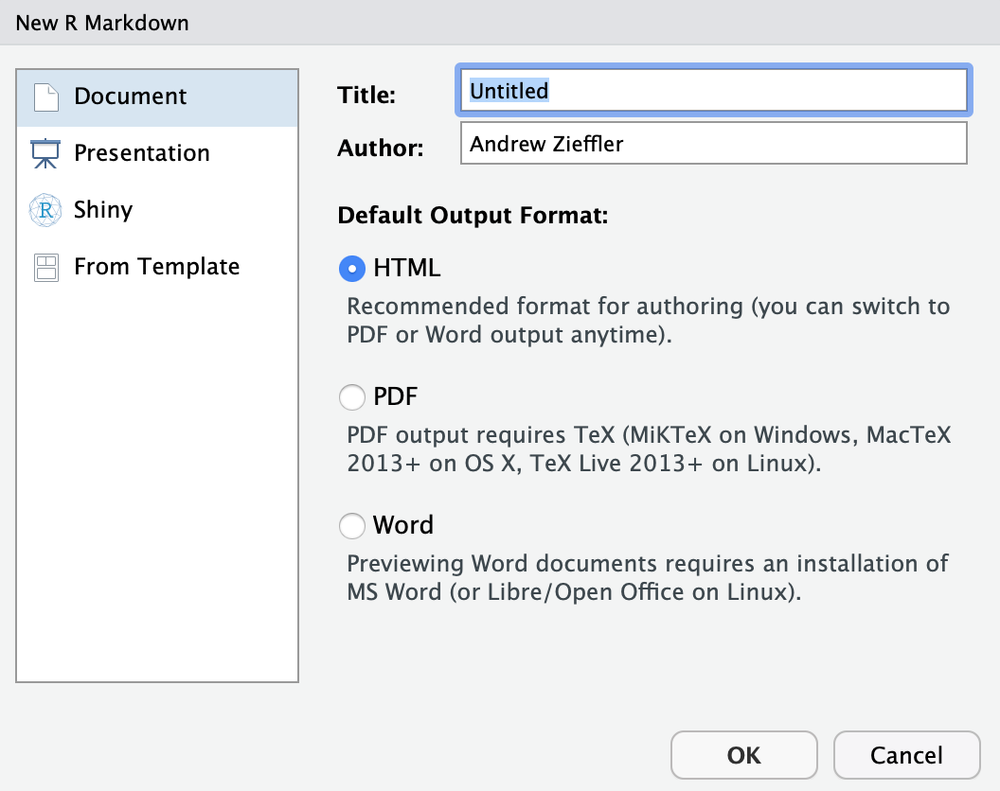
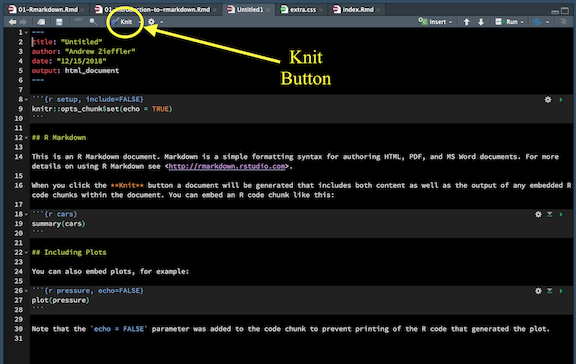
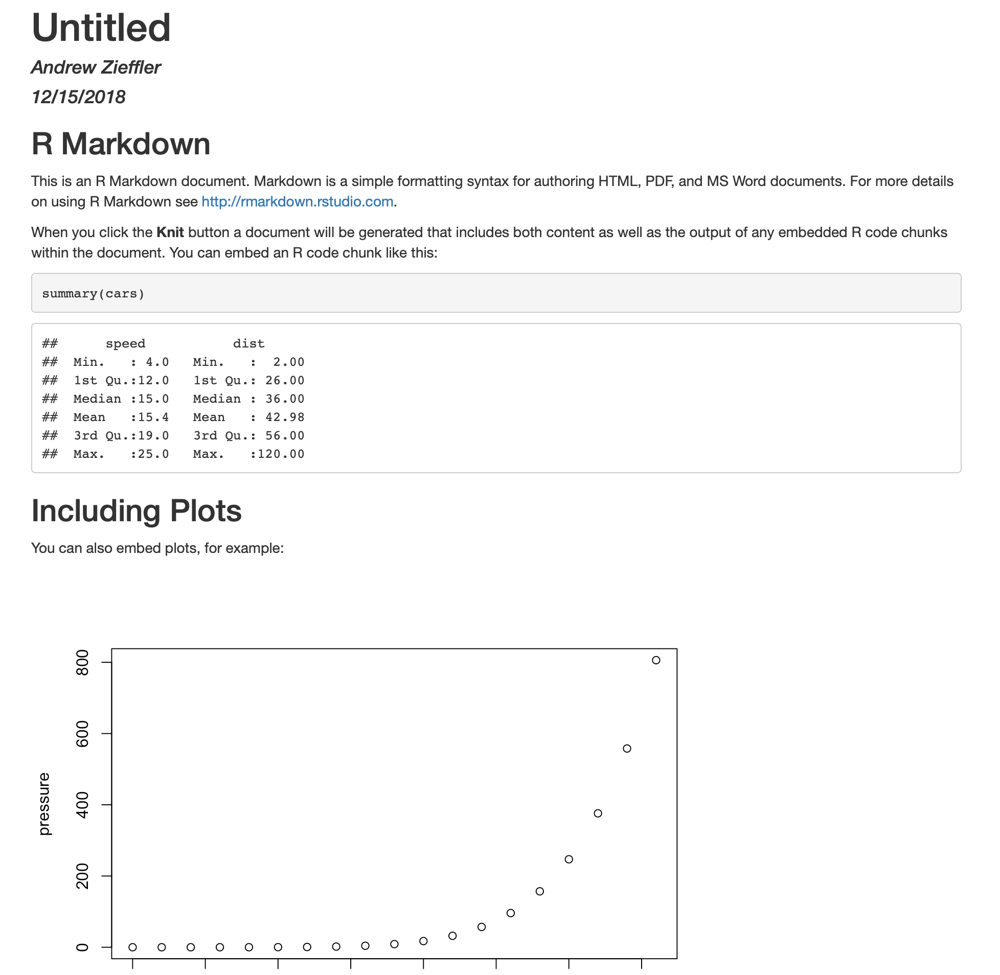
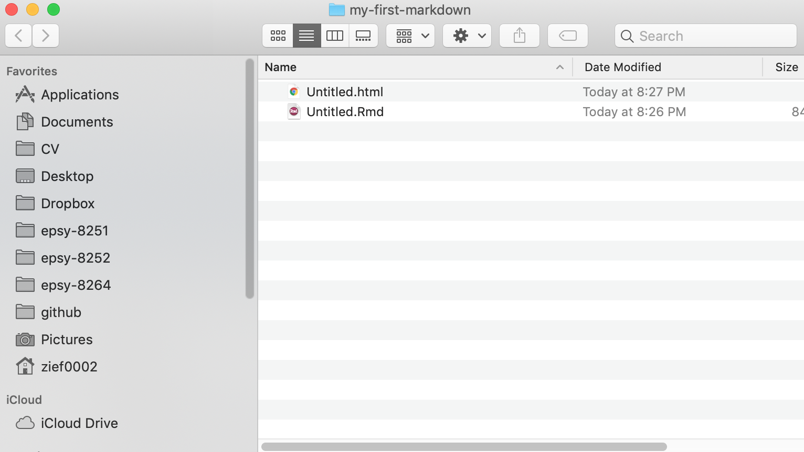
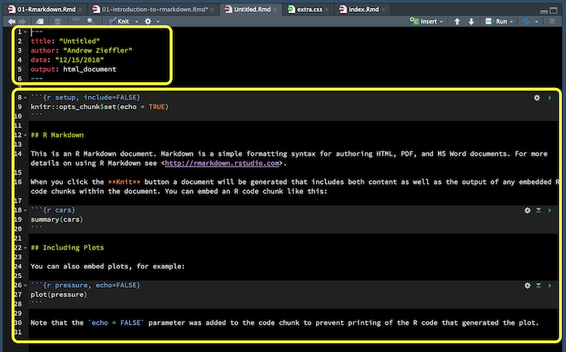

```{r setup, include=FALSE}
options(htmltools.dir.version = FALSE, servr.daemon = TRUE)
```


# Markup and Markdown

.pull-left[
## Markup

A markup language is a system for including both text and software instructions for interpreting/displaying that text in the same document. The markup instructs the software to carry out appropriate actions, but is omitted from the version of the text that users see.

One of the most common markup languages is **Hypertext Markup Language** (HTML)&mdash;the language that powers the web. In HTML, the markup describes the formatting of the text displayed on a webpage. 
]

.pull-right[
## Markdown

Markdown is a more human-readable system for using markup language. It is designed so that it can be converted to HTML and many other formats. 


]


---

# Markup and Markdown Syntax

.pull-left[
## Markup

```
<h1> Heading </h1>
<h2> Sub-heading </h2>


<p> Paragraph </p>


<b> Bold text </b>
<i> Italic text </i>


<ul>
  <li> First list item </li>
  <li> Second list item </li>
  <li> Third list item </li>
</ul>  
```

]

.pull-right[
## Markdown

```
# Heading
## Sub-heading

Paragraphs are just written

__bold text__
_italic text_


- First list item
- Second list item
- Third list item
```
]


---

# Create a New Markdown Document

.pull-left[

<br />

- Under the `File` menu,
- Select `New File > R Markdown...` 

<br />
<br />
<br />
<br />
<br />

- Select `Document`
- Choose the `HTML` format
- Put your name in as `Author:`
- Click `OK`
]

.pull-right[





]

---



This will open a document that has some pre-included text and is formatted using R Markdown. 

Save this document (`File > Save`) on your computer. Then click the `Knit` button.

---

.pull-left[

Knitting compiles the document and formats it according to the markdown you included (or that was pre-included for you).


]

.pull-right[

The actual file you saved has the `.Rmd` extension. The compiled, formatted document has the extension `.html`. 



The HTML file can be opened in any browser. **Examine the HTML document in your bowser.**

]

---

# Anatomy of an R Markdown Document

.pull-left[

There are two major parts to your RMD document.

The first part is called YAML (YAML Ain't Markup Language) and is between the two sets of three hyphens. This constitutes meta-data for your document.

The second part is the main text and markdown formatting for your document.
]

.pull-right[



]

---

# YAML: Changing the Meta-Data

YAML is a human-friendly standard for describing the structure of data and embedded this structure within the data being described. 

```
---
title: "Hello World"
author: "Andrew Zieffler"
date: "January 12, 2019"
output: html_document
---
```


- Change the title of your document and re-knit.

---

# Table of Contents

Adding to the document's metadata allows document formatting. For example, we can add a table of contents to our document.

```
---
title: "Hello World"
author: "Andrew Zieffler"
date: "January 12, 2019"
output:
  html_document:
    toc: true
---
```

Correctly structured YAML needs to be indented **exactly two spaces**.

---

# More Formatting


```
---
title: "Hello World"
author: "Andrew Zieffler"
date: "January 12, 2019"
output:
  html_document:
    toc: true
    toc_float:
      collapsed: false
      smooth_scroll: false
    theme: united
    highlight: tango
---
```


